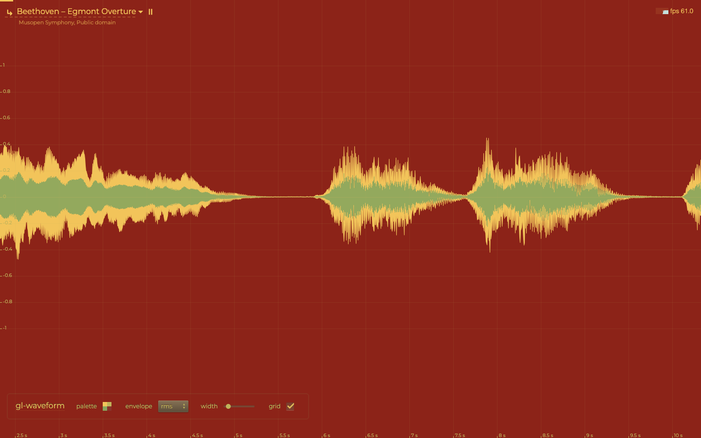

# gl-waveform

WebGL2 renderer for numeric signals, time series and audio. Zoomed out, every pixel column shows the exact min and max of its samples, joined into one outline, with an RMS band inside. Zoomed in, an anti-aliased line runs through the samples, with dots. Pans and zooms at 60 fps over an hour of 48 kHz audio, with no float32 jitter at sample offsets past 1e9.

[](https://dy.github.io/gl-waveform/)

[Demo](https://dy.github.io/gl-waveform/): Bach's cello, Chopin, Vivaldi, Beethoven, a blackbird, a poem read aloud, live radio, the microphone or your own audio, CSV or JSON, coming in from the right as it sounds, in random palettes; or an hour of synthetic speech, 172.8 million samples, pushed as fast as it is generated, with a one-sample spike, silences and clipping. Drag or scroll back; wheel or pinch zooms time, Shift+wheel or a vertical pinch the amplitude. The [v4 demos](https://dy.github.io/gl-waveform/example/old.html) ([multiscale](https://dy.github.io/gl-waveform/example/old-multi.html)) run on v5 too.

## Usage

`npm i gl-waveform`

```js
import Waveform from 'gl-waveform'

// the drawing buffer is yours to size
canvas.width = canvas.clientWidth * devicePixelRatio
canvas.height = canvas.clientHeight * devicePixelRatio

let wf = new Waveform(canvas, { data: samples })  // mono Float32Array
wf.render()

// on every frame of a zoom or pan
wf.update({ range: [from, to] }).clear().render()
```

Stereo, as two lanes on one canvas:

```js
let lanes = [left, right].map((data, i) => new Waveform(canvas, { data, viewport: [0, i * 100, 800, 100] }))
for (let wf of lanes) wf.update({ range }).clear().render()
```

## API

### `new Waveform(target, options?)`

`target` is a canvas, whose WebGL2 context is created (`preserveDrawingBuffer: true`, `antialias: false`) or reused, or a `WebGL2RenderingContext` to share. Waveforms on one context share one shader program; each has its own small texture. `options` go to `update()`.

### `wf.update(options)`

Option | Default | Meaning
---|---|---
`data` | empty | Mono samples; replaces all data. A `Float32Array` is referenced, not copied, and never written to; other array-likes are converted.
`range` | `[0, length]` | Visible `[from, to]` in samples: fractional, may extend past the data.
`amplitude` | `[-1, 1]` | Values at the viewport's bottom and top; `[1, -1]` flips.
`viewport` | whole canvas | `[x, y, width, height]` in CSS px from the canvas' top-left corner.
`color` | blue | Line and envelope: a CSS color, `oklch()` included, or `[r, g, b, a]` in 0..1.
`rms` | `color` | RMS band color; `false` hides the band.
`peaks` | `color`, lightened | The envelope around the RMS band, zoomed out: softer than the band, so a column's body reads darker than its peaks. Without the band (`rms: false`, `density`), `color`.
`density` | `false` | Zoomed out, the fill as bright as noise of the column's RMS is often at each level, against on the axis, in place of the RMS band. `'gaussian'` (or `true`): 10 % + 90 % · e^(−v²/2rms²), a full body that softens toward the peaks, a peak reached once still at 10 %. `'laplace'`: e^(−√2·\|v\|/rms), a soft cloud without outline, as speech is distributed (Gazor & Zhang 2003).
`thickness` | `1` | Line width in CSS px, at least one device pixel.
`pixelRatio` | `devicePixelRatio` | Device px per CSS px.

Keys left out keep their value, `null` restores the default. `update({ range })` only stores the range: cheap enough for every frame.

### Methods

Method | Does
---|---
`wf.render()` | Draws into the viewport, over what is there. Does nothing while the context is lost.
`wf.clear()` | Clears the viewport to transparent.
`wf.push(samples)` | Appends samples.
`wf.set(samples, offset)` | Writes samples from `offset`, extending the data if needed; a gap before `offset` reads as NaN.
`wf.peaks(leaves, offset)` | Summaries of samples held elsewhere: `[min, max, Σx², count]` per 256 samples from `offset` (a multiple of 256). Zoomed out to 1024 samples per px or more, columns are exact from them alone; `set()` writes samples over them, 65536 at a time, for the zoomed-in line.
`wf.drop(from, to)` | Lets go of the samples of the whole 64K chunks within `[from, to)`, keeping their peaks: hours of audio drawn from peaks, with samples only where it is zoomed in.
`wf.pick(x)` | The pixel column at `x` CSS px from the viewport's left: `{ from, to, min, max, rms }` of its samples `[from, to)`, or `null` over a gap. Zoomed in, the sample nearest the column's center.
`wf.destroy()` | Releases the texture, the data and the event listeners.

Properties: `wf.gl`, `wf.canvas`, `wf.length`, `wf.range` (resolved), `wf.amplitude`.

## Rendering

* **Zoomed out**, over one sample per device pixel: each column shows the exact min and max of its samples, and neighbouring columns join into one outline, so a one-sample spike in 10M samples stays visible at full zoom-out. The RMS band spans −rms..+rms within min..max, rms = √mean(x²) over the column, in the line's color; the envelope around it is lighter (`peaks`). Both fade in from 1 to 4 samples per pixel, where the line's color turns into the envelope's.
* **Zoomed in**: an anti-aliased line through the samples. Dots appear at 6 CSS px per sample and reach full size at 12.
* **No seam**: as columns thin out to one sample, the outline becomes the line, so crossing one sample per pixel changes neither peaks nor stroke; ink per sample changes by about 1%.
* **Stable pans**: column edges sit on multiples of samples per pixel, so a pan moves the zoomed-out view by whole pixels and never reshuffles samples between columns. From 1024 samples per pixel, edges round to multiples of 256 samples, at most 1/8 px off, so a column is whole pyramid nodes.
* **NaN** is a gap. **±Infinity** and values past `amplitude` clamp to the viewport edge; `pick()` reports them as they are.
* **Blending** is premultiplied, over whatever is under the viewport, so the canvas can overlay a spectrogram or a grid. The context must have `premultipliedAlpha` (the default).
* **Context loss**: nothing throws while the context is lost; on restore, each waveform that had rendered uploads again and redraws.

## Architecture

1. Samples live in chunks of 64K. `update({ data })` makes views into your array; `set()` and `push()` copy only the chunks they touch; gaps allocate nothing.
2. A pyramid over the samples keeps `[min, max, Σx², count]` in doubles per node of 256·2ᴸ samples: 0.25 bytes per sample, built in one pass, updated in O(k + log n) by `push()` and `set()`.
3. Each frame, the CPU reads every device-pixel column from the pyramid in doubles: exact min, max and RMS from O(log n) nodes plus at most two partial leaves. Absolute sample positions never reach the GPU, so float32 has nothing to round.
4. The results go into one RGBA32F texel per column (zoomed out) or per visible sample (zoomed in), already in viewport pixels: tens of KB per frame. GPU memory is that texture, whatever the data length.
5. One draw per viewport: a quad whose fragment shader measures the distance to the joined column spans, or to the line and its dots, and turns it into anti-aliased coverage.

v4 reduced samples on the GPU instead: it needed float32 fraction-splitting, multipass textures and GPU memory proportional to the data, and drew mean ± deviation rather than peaks.

### Measured

`npm run bench`: headless Chromium 153 on an Apple M4 Max (Metal) with other jobs running (load average ~20), two lanes of 1440×200 CSS px at DPR 2 (2880×400 device px each), synthetic speech. A frame is `update({ range })`, `clear()` and `render()` on both lanes, then `gl.finish()`. Medians of three runs.

Samples | `update({ data })` | Zoom frame, mean / p95 | Pan frame, mean / p95 | Unchanged frame | `push()` of 1024 | Pyramid
---|---|---|---|---|---|---
1M | 1.8 ms | 0.52 / 2.2 ms | 0.11 / 0.3 ms | 0.01 ms | 4 µs | 0.25 MB
10M | 18 ms | 0.77 / 3.1 ms | 2.9 / 3.3 ms | 0.01 ms | 4 µs | 2.5 MB
172.8M (1 h) | 297 ms | 0.90 / 3.2 ms | 2.8 / 3.3 ms | 0.01 ms | 14 µs | 43 MB

Zooming continuously on `requestAnimationFrame` runs at 60 fps at every size. `update({ data })` is one pass at about 1.7 ns per sample of speech. Frames cost most between 256 and 1024 samples per pixel (the pan row), where columns scan partial leaves. Of 723 zoom frames over 172.8M samples, two took over 4 ms: the first after loading (30 ms) and one at 633 samples per pixel (7 ms).

## Changes from v4

* ESM with a default export, WebGL2, no dependencies. Was CommonJS on WebGL1 with regl, glslify and 16 more packages.
* Draws exact per-column min/max with an RMS band, a sample line and dots. Was mean ± standard deviation from running sums in float32 textures.
* GPU memory is one texture sized to the viewport. Was every sample in float textures.
* `pick(x)` returns `{ from, to, min, max, rms }`, with `x` in CSS px from the viewport's left. Was `pick(event | x)` returning `{ average, sdev, x, y, offset }`.
* `viewport` is in CSS px; was device px.
* `amplitude` defaults to `[-1, 1]`; was the data's min/max.
* Added: `rms`, `peaks`, dots, ±Infinity clamping, context loss handling, `length`.
* Removed, with replacements where one exists:
  * `new Waveform()` without a target, `container`, `regl` and `new Waveform(otherWaveform)`: pass a canvas or a WebGL2 context.
  * Setters `wf.range = …`, `wf.amplitude = …`, `wf.viewport = …`, `wf.color = …`: use `update()`. `range` and `amplitude` stay as getters.
  * `flip`: use `amplitude: [1, -1]`.
  * `clip` and rectangle objects: use `viewport: [x, y, width, height]`.
  * `opacity`: use the color's alpha.
  * 4-value `range`: use `range` and `amplitude`. Numeric `range` (last N samples) and `amplitude` as a number: pass arrays.
  * `thickness` with units (`'3em'`): pass CSS px. Color arrays in 0..255: pass 0..1.
  * `update(array)`: use `update({ data })`. `push(...values)` and `push(number)`: use `push(samples)`. regl textures as `data`.
  * `pick: false`, `line`, `mode`, `pxStep`, `sampleStep`, `shape` and the option aliases (`samples`, `amp`, `width`…).
  * `regl`, `total` (now `length`), `minY`, `maxY`, `textures` properties.

## Develop

* `npm test`: every pixel column's stats against brute force over the samples (random data, NaN runs, ±Infinity, 0 to 1M samples, `push`/`set` edits, offsets near 1e9, 1e-3 to 1e5 samples per pixel), pixel checks through `readPixels` (spike, line and dots, lanes, resize, transparency, joins, the zoom threshold, gaps, colors, offset 1e9 drawn as offset 1000), context loss and the API contract. Headless Chromium through Playwright; `npx playwright install chromium` if it is missing.
* `npm run bench`: the table above.
* Demo: any static server at the repo root, e.g. `npx serve`, then open `/`. `?source=cello` picks a recording, `wqxr` the radio, `mic` the microphone. The first v5 demo is at `/example/stress.html`, the v4 demos at `/example/old.html` and `/example/old-multi.html`.

## License

© 2018 Dmitry Yv. MIT License
